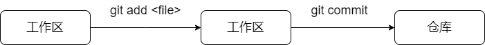
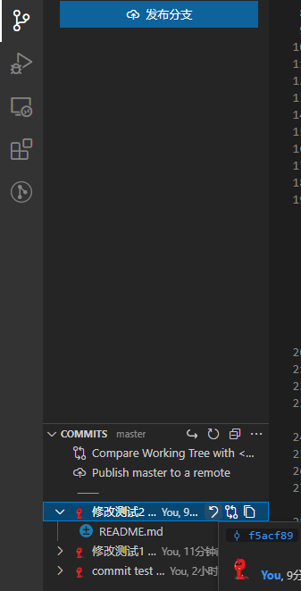
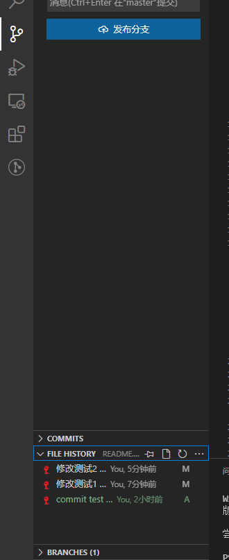
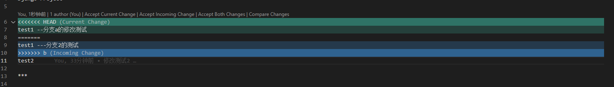
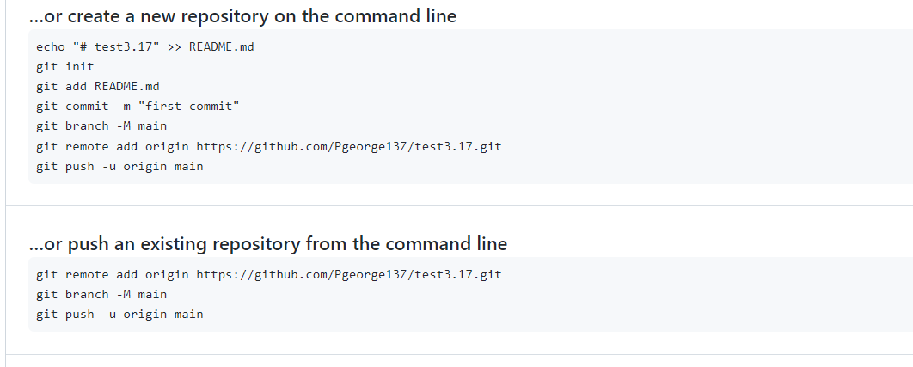

# git study

## 初始化:  
*  git init

1. 添加文件到暂存区 
git add -A  
2. 将暂存区文件提交到仓库 //在vscode中 ctrl+Enter 直接提交  
git commit -m "提交信息"   
  

3. 提交的历史记录  
git log --stat 

4. 工作区回滚    
git checkout < filename >  //在vscode中 直接可视化撤销

5. 撤销最后一次提交
git reset HEAD^1  //在vscode中 直接可视化撤销  

6. 查看提交历史记录  
从vscode中的file HISTORY查看  

7. 以当前分支为基础新建分支  
git checkout -b <branchname>

8. 单纯地切换到某个分支  
git checkout <branchname>

9. 删掉特定的分支  
git branch -D <branchname>

10. 合并分支(纳入别的分支的内容)
 git merge <branchname>

 11. 列举所有的分支  
 git branch
 git branch -a //查看包括远程分支

 12. 合并分支的过程中，不同分支更改同一处内容，并产生冲突：  
* 可以在可视化界面中选择要保留的内容(删除、保留、或全选)，如下图所示：
  
选择上方的 Accept Current Change就是接受前一个合并的分支  
选择上方的Accept Incoming change就是接受即将到来的冲突分支

* 若不会处理冲突，暂不处理命令
git merge --abort 

* 若有信息某个分支是绝对正确，可以在VS中右键文件，选择全部默认采用...

13. 建立github仓库 并提交本地仓库到远端 (建立github时会提示)

git remote //查看远程仓库
git remote add origin +地址   //给地址起别名
git branch -M main  //给分支改名
git push -u origin main

14. 推送当前分支最新的提交到远程  
git push 
ag: git push origin master  
用 -u 后一次后，git push默认代表 git push origin master

15. 拉取远程分支最新的提交到本地  
git pull  
pull= fetch +merge
git fetch origin master //抓取到本地，此时使用cat命令查看时，是远程游离态的新信息，但未合并到本地 
git merge origin/master //合并，此时本地文件与新提交的远程游离态合并。
合并等于:git pull origin master

16. 克隆命令好处：  
git clone 地址  
* 下载文件到本地  
* 创建origin远程地址别名  
* 初始化本地库  

17. 提交本地库与远程库的冲突  
当两个参与者共同修改同一个文件时，后提交者无法提交：因为第一个修改的人已经改变了远程库，因此后者需要先pull远程库到本地，更新本地内容后，再push上去。
